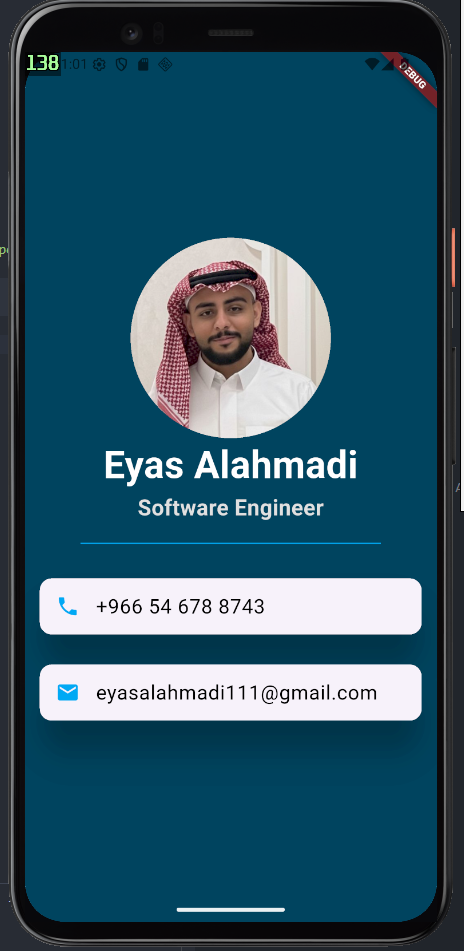

# Betakati App - Simple Digital Business Card 📇

A simple and clean digital business card application built using **Flutter**. This project demonstrates basic UI layout principles and the effective use of core Flutter widgets.

## 🚀 Features
* **Simple UI:** Straightforward design focused on displaying contact information.
* **Basic Layouts:** Use of vertical and horizontal alignment.
* **Material Design:** Clean appearance using cards and icons.

## 🏗️ Core Widgets Used
* **Column:** For vertical stacking of profile and info.
* **Row:** For horizontal alignment of icons and text.

## 📱 Preview

  

---
📫 **Connect with me:** [eyasalahmadi7@gmail.com](mailto:eyasalahmadi7@gmail.com)
